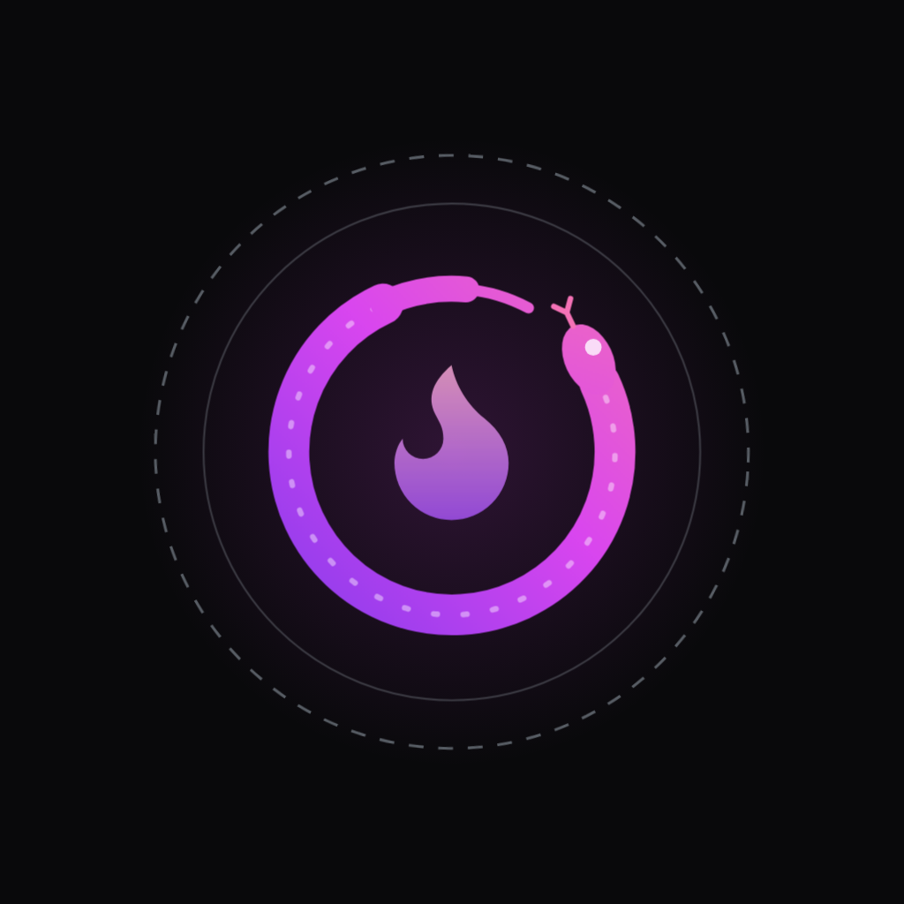

<p align="center">
  
</p>

<h1 align="center">Orochia for iOS and Android</h1>

<p align="center">
  The creator video platform, in your pocket — stories, the feed, protected 4K playback, challenges and auctions,<br>
  on the same API and the same rules as <a href="https://github.com/krizaka/orochia">orochia.com</a>.
</p>

<p align="center">
  <a href="https://github.com/krizaka/orochia-mobile/actions/workflows/ci.yml"></a>
  
  
  
</p>

---

## What it does

| | |
| :--- | :--- |
| **Stories & feed** | The creators you may see, unseen rings first; the feed with what each video is for (free, followers, contacts, unlock, invited, auction, backers) |
| **Protected playback** | HLS from Bunny Stream, signed by the server for you for five minutes — the app never holds a raw media URL. Picture-in-picture, full screen |
| **Challenges** | Goals, dares and open calls: the pot as a ring that fills as pledges land, the clock, the leaderboard, back it in one tap — credits held until delivery |
| **Auctions** | The price, the clock aligned on the server's, bids by alias, bid in credits |
| **You** | Sign in (the session lives in the Keychain / Keystore), wallet and what is held, notifications |

Paying (top-ups, unlocks) happens on orochia.com, in the payment provider's own checkout: card details never reach
Orochia, and an adult-content platform cannot sell through the stores' in-app purchases.

## Why React Native (Expo), not Flutter

Bunny Stream has no mobile SDK of its own for either framework: what an app needs is **HLS playback** and **Tus
uploads**, both open standards. On React Native, `expo-video` plays HLS natively (AVPlayer on iOS, ExoPlayer/Media3 on
Android) and `tus-js-client` speaks Tus; Flutter has equivalents (`video_player`, `tus_client`) — so Bunny decides
nothing. What decides is everything around it:

- **One language, one set of types and rules** with the web app (TypeScript, the same API shapes, the same message
  conventions) and the Orazaka mobile client, already on Expo.
- **The same design tokens and brand mark, from npm** — `@krizaka/orochia-design-system/tokens` (themes by role) and
  `@krizaka/ui/native` (the animated Orochia mark, drawn from the same geometry as on the web). Never a copy; Flutter
  would need a second, drifting implementation of both.
- **Builds without local Xcode or Android Studio** (EAS, or the Android CI build below), over-the-air updates for
  JavaScript changes.

## Run it

```bash
npm install
npx expo start             # press i (iOS simulator), a (Android emulator) — or scan with a development build
npm run check              # lint, type-check, tests, iOS and Android bundles
```

It talks to `https://dev.orochia.com` by default. To use a local Orochia (`npm run dev` in
[krizaka/orochia](https://github.com/krizaka/orochia)):

```bash
EXPO_PUBLIC_OROCHIA_URL=http://192.168.1.10:3000 npx expo start   # your machine's address, reachable from the phone
```

`expo-video` and `expo-secure-store` are native modules: use a development build (`npx expo run:ios` /
`npx expo run:android`), not Expo Go.

## Builds

| Platform | How |
| :--- | :--- |
| **Android** | A `v*` tag builds a preview APK in CI and attaches it to the GitHub release — install it directly on a device |
| **iOS** | `npx eas-cli@latest build --platform ios` with the organisation's Apple Developer account (TestFlight / ad hoc) |

Store listings: Apple and Google do not distribute apps whose purpose is sexually explicit content. Orochia is for
adults (18+ gate at first launch, the same 18+ rules as the web), so distribution is outside the stores — APK on
GitHub, TestFlight / ad hoc on iOS — unless a store-safe edition is decided.

## How it is built

```
src/app/                 Expo Router: (tabs) home · challenges · auctions · you; watch/[id], challenges/[id], auctions/[id]
src/components/          ui (Txt, Card, Button, Chip…), tiles, stories rail and viewer, progress ring, countdown, 18+ gate
src/lib/                 api (bearer session, typed errors), auth (sign-in, secure storage), theme (design-system tokens),
                         useApi / usePolling, config (EXPO_PUBLIC_OROCHIA_URL)
src/i18n/en.json         every user-facing string (typed keys)
```

- **Sessions**: `POST /api/auth/login` with `client: "native"` answers the signed session token, kept in secure storage
  and sent as `Authorization: Bearer` — the same token, verification and account re-read as the web's cookie.
- **Kept current**: React Native has no `EventSource`, so open challenges and auctions refresh every few seconds while
  the app is in the foreground, without a spinner.
- **Themes**: the system's appearance, with the design system's dark and light palettes by role.

---

Apache-2.0 · Part of [Orochia](https://github.com/krizaka/orochia) by [Krizaka](https://www.krizaka.com) — open source,
closed to compromise.
